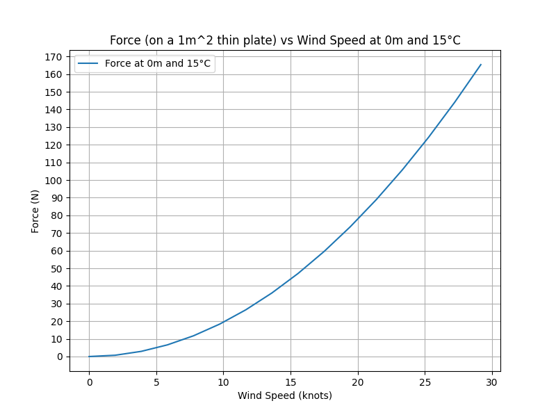

# Kite Force Simulator



## Overview
This Python script performs simulations to calculate forces exerted on a kite under different environmental conditions. It takes into account various factors such as wind speed, altitude, and temperature. The script produces several types of visualizations, including contour plots and line graphs, to better understand the dynamics.

## Dependencies
- numpy
- matplotlib

## Constants
- `R`: Specific gas constant for dry air
- `Cd`: Drag coefficient for a flat plate
- `A`: Area of the flat plate
- `KtoC`: Kelvin to Celsius conversion factor
- `ms_to_knots`: Conversion factor from m/s to knots

## Data Ranges
- `temperatures`: Array of temperatures in Celsius
- `H`: Array of altitudes in meters
- `V`: Array of wind velocities in m/s

## Features
1. **Air Density Calculation**: Calculates air density based on given equations for pressure and temperature.
2. **Force Calculation**: Computes the force exerted on a kite for a given air density, wind speed, and kite size.
3. **Data Visualization**: Produces contour plots and line graphs for better understanding and interpretation.
4. **Kite Size Multiplier**: Calculates a multiplier based on standard atmospheric conditions to adjust kite sizes.
5. **Wind Speed vs Force Graphs**: Generates graphs showing the relationship between wind speed and force for different kite sizes.

## Usage

1. **3D Data Arrays**: Initialize 3D arrays to hold force and air density data.
2. **Calculations**: Perform calculations to fill these arrays.
3. **Data Slice**: Extract data slices for specific conditions (e.g., 0m altitude and 15°C temperature).
4. **Visualizations**: Generate plots and save them as SVG or PNG files.

## Output Files
- `percent_diff.svg`: Contour plot showing percent difference in air density compared to standard atmospheric conditions.
- `kite_size_multiplier.png`: Contour plot showing kite size multiplier compared to standard atmospheric conditions.
- `force_vs_wind_speed_0m_15C.svg`: Line graph showing force vs wind speed at 0m and 15°C.
- `wind_speed_vs_force_0m_15C.svg`: Line graph showing wind speed vs force at 0m and 15°C.
- `peak_hybrid_force_0m_15C.svg`: Horizontal bar graph showing force ranges for different kite sizes at 0m and 15°C.

## How to Run
1. Install the required dependencies.
2. Run the script.

```bash
python kite_force_simulator.py
```

## Note
The script currently contains commented-out sections for generating contour plots for individual temperatures. Uncomment these sections if needed.

## Contributing
Feel free to submit pull requests or open issues to improve the script.

## License
This project is open-source and available under the MIT License.
